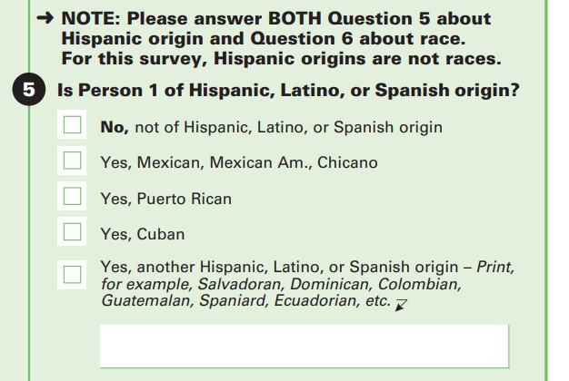
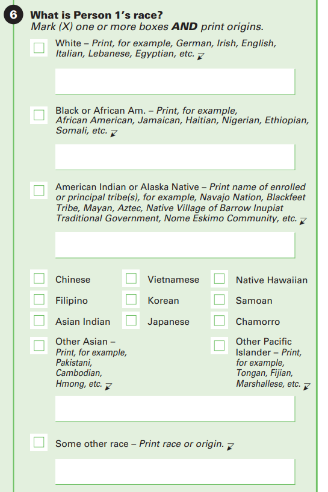
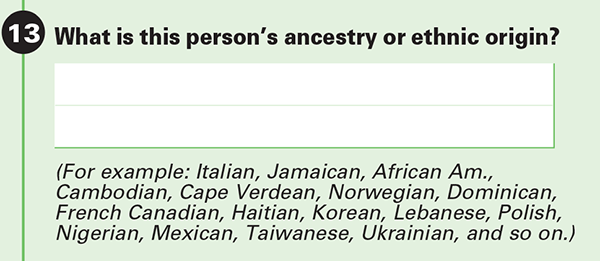

```{r}
#| label: setup
#| include: false
library(here)
library(kableExtra)
source(here("utils","check_packages.R"))
source(here("utils","functions.R"))
load(here("data","data_constructed","analytical_data.RData"))
```

## **Introduction**

On January 1, 1952, the Bureau of Indian Affairs (BIA) launched the Voluntary Relocation Program, and established field offices in Chicago, Salt Lake City, Denver, San Francisco, San Jose, Los Angeles, Oakland, Portland, Dallas, Tulsa, Oklahoma, St. Louis, Minneapolis, Cincinnati, Cleveland, and Joliet and Waukegan, Illinois[@kent-stollDispossessoryCitizenshipSettler2024]. The program was advertised as a pathway to economic stability, promising Indigenous Americans better employment opportunities, improved housing, and an overall better quality of life if they decided to leave their communities on rural reservations for faraway urban centers [@rosenthalReimaginingIndianCountry2012c]. However, beneath the promise for a better life was the federal agenda of forced assimilation which sought to sever the connection between Indigenous people from their homelands, cultures, and tribal affiliation in favor of integration into mainstream society.

In 1956, the federal government continued these policies of assimilation with the passage of the Indian Relocation Act (Public Law 949), which initiated a new program, the Adult Vocational Training program. This program offered housing assistance, vocational training, and job placement services under the BIA. The selection process for the AVT program was meticulous, because if the US government was going to pay for Indigenous Americans to gain an education and vocational skills, they wanted to “identify the applicants with the greatest potential for making a clean break from the reservation and assimilating into the city” [@rosenthalReimaginingIndianCountry2012c p. 53]. The VRP and the AVT programs were deeply rooted in federal policies that were designed to erode Indigenous identity and community ties.

Despite these efforts, the relocation of thousands of Indigenous individuals to urban centers led to the emergence of new forms of Indigenous identity and political consciousness. In many cities, relocated individuals found themselves in shared experiences of marginalization and cultural dislocation, leading to the development of inter-tribal and pan-Indian identities.These urban Indigenous communities established organizations focused on mutual aid, social services, education, and political activism. It was within these very spaces that the Red Power Movement gained momentum, ultimately giving rise to the American Indian Movement (AIM). In response to systemic anti-Indigenous policies, discrimination, and police violence, Indigenous activists mobilized, advocating for self-determination, tribal sovereignty, and Indigenous rights on a national scale [@kent-stollDispossessoryCitizenshipSettler2024]. This article aims to illuminate this process by asking: What role does geography and ethnicity play into racial identification for Indigenous, multiracial respondents? This article engages with settler-colonialism, racial formation theory, and socio-historical context as a guiding framework to interpret findings.

Examining the history of Indigenous relocation highlights a need to understand the role of geographic settings—whether metropolitan, rural, or a homeland—in shaping racial identity and classification[^1]. Investigating these dynamics is essential to understanding how Indigenous peoples negotiate their identity through limiting racial categories like AIAN, and how historical and structural forces continue to influence how Indigenous identity is constructed, recognized, and legitimized through bureaucratic means like the American Community Survey (ACS).

[^1]: it should be noted that being Indigenous is not only a racial category, but speaks to a specific socio-political relationship a community has with a settler-colonial state, which entails the flattening of distinct communities into broad categories like AIAN (American Indian/Alaskan Native)

## **The Formation of a Multiracial Indigenous Identity**

In 2010, Liebler published an article that found that “homelands — physical places with cultural meaning —are an important component of the intergenerational transfer of a single-race identity in indigenous mixed-race families” [@ipumsus; @liebler2010 p.596]. She came to this conclusion after asking what is it about Homelands that make them, “so special to the maintenance and transmission of a strong identity” [@liebler2010 p.597]. To answer this question Liebler estimated logistic regression models predicting the likelihood of children who had a interracially married single-race American Indian parent, reporting them as single-race American Indian on the 2000 Census. Her models accounted for several factors including the racial composition of the local area, geographic isolation, family and area poverty levels, and ties to other American Indians or other people. Liebler concluded that the variable's predictive power can be attributed to the history and cultural significance of Indigenous homelands, while simultaneously encouraging scholars to, “attend to the history and meaning of the actual location itself...connections to land bases themselves are neglected in theory and research devoted to this broad topic” [@liebler2010 p. 606]. Liebler did subsequent research on ‘race history’, finding a relationship between place and identity claims [@liebler2016]. Liebler’s work affirms the findings of both Indigenous and non-Indigenous scholars on the importance of homelands in Indigenous identity formation insert citations for that work.

This article aims to build on this work, not only by considering an adult, multiracial Indigenous population, but also by explicitly engaging with settler-colonial theory when discussing Indigenous identity. The significance of engaging with settler-colonial theory is that while it is important to understand the historical context of place in relation to identity, it is through settler-colonialism that the settler-colonial logic of events like the Trail of Tears and assimilation policies like the Indian Relocation Act can be understood in their true purpose. As aptly surmised by Patrick Wolfe, settler-colonialism is a “structure rather than an event,” which allows us to situate historical events within the larger structure of the settler-colonial project and its goal of Indigenous elimination. Additionally, interpreting findings in relation to settler-colonial theory can offer new avenues to contextualize demographic research on Indigenous populations.

To do this I attend to the theoretical intervention found within, “Theorizing race and settler colonialism within U.S. sociology” by engaging with settler-colonialism directly because, as the authors' stress, "Attending to settler-colonial structures is not only crucial for developing an understanding of the experiences of Indigenous peoples today; it fundamentally informs and enriches sociological approaches to race" [@mckay2020b p. 12]. I do this by acknowledging that the ACS and Census legitimize the flattening of Indigenous identity into the racial labels of AIAN, and exemplifies the undermining of tribal sovereignty by imposing racial identities onto Indigenous communities [@bird1999; @gilio-whitaker2024].

Quantitative research on Indigenous identity, particularly how it it intersects with multiracial identity is complicated, and this article aims to critically engage with this intersection, and utilizes settler-colonial theory to do this, as previous research has emphasized the importance of being mindful of Indigenous peoples unique relationship with the United States [@mckay2020; @mckayRealIndiansPolicing2021a; @robertson2013; @gilio-whitaker2024; @rodriguez-lonebear2021; @small-rodriguezTribalSovereigntyLimits2023].

### **Racial Formation and Being Multiracial**

Racial Formation Theory dominates sociology of race and ethnicity due to its emphasis on the social construction of race, and it has become a truism within the field. Racial formation theory came from a desire to address some of the shortcomings of racial theories of the time, specifically theories of race that posited that race was a manifestation of other sociopolitical concepts like ethnicity, class, or nation [@omi2015]. Key components of racial formation theory are the concepts of racialization and racial projects. Omi and Winant defined racialization as “the extension of racial meaning to a previously racially unclassified relationship, social practice, or group,” [@omi2015 p. 111]. It is through racialization that Indigenous communities have been collapsed into broad racial categories like AIAN. They argued that race is a master category that is a fundamental principle for the organization of social stratification, and racial projects are the ways in which those racial meanings are integrated into social structures in a dynamic and interdependent fashion. They also emphasized the sociohistorical nature of race in their definition of racial formation itself, as racial formation is “the sociohistorical process by which racial identities are created, lived out, transformed, and destroyed,” [@omi2015 p. 109].

Scholarship on multiracial identity often emphasizes its ability to challenge U.S. racial hierarchy by exposing the social construction and rigidity of racial categories [@anthony2025; @brunsma2013; @rockquemore2009; @rogers2025]. Examples would include seeing how multiracial identity can disrupt patterns of hypo-descent and hyper-descent. Hypo-descent refers to the practice of categorizing mixed-ancestry individuals into the socially subordinate racial group, while hyper-descent assigns them to the socially dominant group [@iverson2022]. Gullickson and Morning demonstrate this in the search for identifying what ‘rules’ guided the identification process for multiracial individuals [@gullickson2011]. They found three distinct regimes of classification: mixed-race individuals of Asian descent were more likely to identify as multiracial, those with Black/African ancestry followed the regime of hypo-descent (more likely to identify as only Black), and those with White and American Indian ancestry were more likely to identify as only White (hyper-descent). The authors further divided these regimes into ‘historical’ and new/immigrant regimes. For example, the historical regimes of hypo and hyper-descent have historical origins that can be traced back to slavery and the settler-colonial project of Indigenous elimination respectively, which the findings suggest continue to shape patterns of multiracial identity. The authors suggest that the ‘new’ immigrant regime could be explained by the fact that, “not enough time has passed for rigid racial-assignment rules to have formed for this group since Asian ancestry typically implies a generationally recent immigration to the United States” [@gullickson2011 p.506]. While patterns of hyper-descent and hypo-descent may persist in quantitative findings, it is important to acknowledge these patterns are representative of larger structural forces that aim to make race real, and the ‘new’ regime highlights highlights how multiracial Asians disrupt these patterns.

### **Counting Indigeneity**

The first U.S. census explicitly excluded Indigenous populations in accordance with the constitution, and while that has changed, Indigenous populations continue to be undercounted on reservation lands, which results in revenue loss for both states and tribal governments [@connolly2020; @huyser2020]. This undercounting on reservation lands brings up a unique tension: Indigenous populations are undercounted on tribal lands yet within the census there have been astronomical jumps in the Indigenous population that cannot be explained just by births or immigration of Indigenous Central and South Americans. Research on this topic has concluded that these changes can be accounted by those who who have changed their race response after several distinct changes to the census: allowing a mutliracial race response and the expansion of the definition for the AIAN category which has led to an increase in Latino American Indians [@liebler2017; @liebler2014]. This tension requires an analysis that takes into account settler-colonial theory when interpreting results.

## **Sample Selection and Data**

The data used for this article was compiled from the American Community Survey (ACS) data for 2010-2020 [@rugglesIPUMSUSAVersion2024]. The ACS is disseminated by the Census Bureau every month and is sent to about 3.5 million addresses across all 50 states, the District of Columbia, and Puerto Rico every year [@bureauImportanceAmericanCommunity]. The ACS asks about topics that are not covered by the Census such as education, employment, transportation and other helpful information that can be used by both local and national leaders to make informed decisions related to the economy, emergency management, and local issues.

To analyze the race reporting of individuals with multiracial Indigenous ancestry, the write-in ancestries from the ancestry question were used[^2]. To accomplish this the responses were “racialized’ in the same fashion as done by Gullickson & Morning @gullickson2011. Although the free response nature allows respondents to be quite detailed in their responses, they are not always consistent with Census racial options, which is evident with the over 500 unique responses to the ancestry question. To make this number more manageable, racial ancestries were recoded to align with the Office of Management and Budget’s (OMB) different race categories, which include white, black, American Indian or Alaskan Native, Asian, and Pacific Islander[^3] [@bureauTopicRace].

[^2]: See Appendix

[^3]: See Appendix

Respondents who listed their ancestry as Latino or Pacific Islander were dropped from the potential multiracial Indigenous population. The reason for dropping Latino is that it functions as an ethnic category on the ACS and respondents of Latino or Hispanic origin can be of any race, so Latino does not indicate a specific racial ancestry that is easily understood as distinct from Indigenous or any other racial category. A similar clarity issue exists for the Pacific Islander (PI) category. Since Pacific Islanders are Indigenous to their respective nations this could create the issue of a double Indigenous ancestry group depending on how respondents perceive their ancestry and to avoid this potential discrepancy they were also excluded from the sample.

After the final case selection was concluded the sample size was 490,172 respondents. Once this population was identified their ancestry selections were compared to their racial responses.

When reviewing respondents' racial ancestry and their race response, four distinct identification patterns were identified 1) Indigenous 2) Multiracial 3) non-Indigenous Race Alone 4) Inconsistent, where respondents race response did not reflect their racial ancestry in any capacity. The inconsistent group was reviewed and it was found that the large majority were respondents who had listed their racial ancestry as Indigenous and Asian. Previous research on multiracial Asian classification suggests that multiracial Asians are more likely to go against historical patterns of racial classification due to the “newness” of mixed-Asian racial regimes or to go towards a multiracial identity [@gullickson2011; @xu2021]. Due to the focus on identifying patterns either towards a multiracial or Indigenous identity alone, which this group did not align with, and consisting of less than 1% of total responses, the inconsistent group was dropped from further analysis, bringing the sample to 478,680 respondents.

For this study, the term Indigenous is used in place of the American Indian and Alaskan Native (AIAN) category for simplicity's sake as it functions as a collective term since this article does not focus on a specific Nation, reservation, group, and so on. It should be noted that this is not done to imply Indigenous people are a monolith rather is a necessity when conducting research that seeks to find patterns of racial identification that span across individual groups as evidence of the unique role of settler colonialism in the racialization of Indigenous people in the U.S.

It is important to note that race and ancestry are two separate ideas but are interrelated. Race is generally understood as an inheritable master status that affects how an individual navigates the social world. Ancestry, however, is often more detailed yet less apparent regarding identity status, which may or may not be represented in how an individual identifies racially.

## **Analytic Approach**

Part of the data organization for this article required the identification of a multiracial population, specifically an Indigenous multiracial population. The Goldstein and Morning method was adopted, which relies on looking at adults' self-reported ancestry [@goldstein2000]. This approach is beneficial since it does not rely on the race question to identify a multiracial Indigenous population, the multiracial population captured with this approach is aware of their ancestral descent, and takes advantage of the free response nature of the question of the ancestry nature. To conduct my statistical analyses, I use several multinomial regression models to estimate the relationship between racial ancestry, race response, and the predictor variables.

### **Dependent Variable**

The dependent variable has three categories of race response: Indigenous (respondents that listed their race solely as Indigenous regardless of their multiracial ancestry), Multiracial (respondents that selected a racial response that reflected a multiracial identity), and non-Indigenous Race Alone (respondents' race response did not reflect their Indigenous ancestry and selected their identity solely as the non-Indigenous race alone e.g., Black, Asian or White).

### **Independent Variable**

The key independent variables are racial ancestry and metropolitan status (unknown status, non-metropolitan area (rural), metropolitan area).

When first organizing the data for analysis it became apparent that some ancestries did not align with the official categories of the OMB or were otherwise unclear. These categories included Latino, Caribbean, non-Latin Caribbean, South American, Middle Eastern, American, and Mixed, with the latter being racially uninterpretable. These ancestries were combined and/or recoded when appropriate to fit the OMB categories better. For example, the Black ancestry group was created by combining all those whose ancestry fell under the groups of African-American, non-Latin Caribbean, and Sub-Saharan African. The Asian category included those whose ancestry fell under East, South East Asian, and South Asian. The White category included those with European, North African, and Middle Eastern ancestry. The Indigenous group included American Indian (All Tribes), Aleut, Eskimo, and Inuit ancestry responses but did not include those who listed Central and South American Indian ancestry. The reason for this distinction was so that the ancestry response would align as best as possible with its respective race category, American Indian or Alaskan Native (AIAN).

### **Controls**

The predictor variables are homeland area (binary), educational attainment (less than HS diploma, HS diploma, some college, 4-year degree or more), gender (binary), Hispanic origin (binary), and age (continuous, 18+).

## **Results**

My research question focuses on understanding the relationship between metropolitan status and the racial decision-making process for those with mixed Indigenous ancestry, in addition to determining how rurality affects the predictive power of the Homeland variable. I use the focal predictor variables to answer this question by identifying the relationship between the dependent and independent variables and the predictor variables. Each table presents coefficients, standard errors, and significance levels for the multinomial logistic regression models predicting race response with the predictor variables. Non-Indigenous Race alone is the reference group for each model, as the goal of the article is to determine how rurality and the Homeland variable influence a move towards Indigeneity or multiracial identity. @tbl-1 represents respondents with White and Indigenous ancestry, @tbl-2 represents respondents with Black and Indigenous ancestry, and @tbl-3 represents respondents with Asian and Indigenous ancestry. The model results compare the predicted race response of Indigenous Alone and Multiracial to non-Indigenous Race Alone with a separate table for each ancestry group. The base models of each table look at racial responses in relation to metropolitan status, the subsequent model adds Homeland status and the final model adds educational attainment, gender, Hispanic origin, and age. This setup creates three tables with three models each for a total of 9 models.

```{r}
# label: customize-responses
DATA <- DATA |>
  filter(race_response!="Inconsistent")
DATA$race_response <- factor(DATA$race_response,
                             levels=c("Non-Indigenous Race Alone",
                                      "Indigenous, Alone",
                                      "Multiracial"))
DATA$race_response <- forcats::fct_recode(DATA$race_response,
                                               "Indigenous" = "Indigenous, Alone")

```

```{r}
#| include: false
#model set up stuff
cm <- c('(Intercept)' = '(Intercept)',
        'MetroCMetropolitan'    = 'Metro Area',
        'MetroCUnknown'    = 'Uknown Area',
        'HomelandPYes' = 'Homeland Area',
        'EducAHS Diploma' = 'HS Diploma',
        'EducASome College' = 'Some College',
        'EducACollege' = 'College Degree',
        'GenderMan' = 'Man',
        'HispanicHispanic' = 'Hispanic',
        'Age' = 'Age')
model1 <- multinom(race_response~MetroC,
                  data=subset(DATA, race_ancestry=="Indigenous/White"))
model2 <- update(model1, .~.+HomelandP)
model3 <- update(model2, .~.+EducA+Gender+Hispanic+Age)
model4 <- multinom(race_response~MetroC,
                  data=subset(DATA, race_ancestry=="Indigenous/Black"))
model5 <- update(model4, .~.+HomelandP)
model6 <- update(model5, .~.+EducA+Gender+Hispanic+Age)
model7 <- multinom(race_response~MetroC,
                  data=subset(DATA, race_ancestry=="Indigenous/Asian"))
model8 <- update(model7, .~.+HomelandP)
model9 <- update(model8, .~.+EducA+Gender+Hispanic+Age)
```

```{r}
#| label: tbl-1
#| tbl-cap: Respondents with White and Indigenous Ancestry
#| results: asis
modelsummary(list(model1,model2,model3),
             digits=3, shape = term ~ model+response, stars = TRUE,coef_map = cm)
```

```{r}
#| label: tbl-2
#| tbl-cap: Respondents with Black and Indigenous Ancestry
#| results: asis
modelsummary(list(model4,model5,model6),
             digits=3, shape = term ~ model+response, stars = TRUE,
             coef_map = cm)
```

```{r}
#| label: tbl-3
#| tbl-cap: Respondents with Asian and Indigenous Ancestry
#| results: asis
modelsummary(list(model7,model8,model9),
             digits=3, shape = term ~ model+response, stars = TRUE, coef_map = cm)
```

### **Metropolitan Status**

Metropolitan status indicates whether someone lives in a metropolitan area or not. For people with both White and Indigenous ancestry, living in a metropolitan area had different effects on their likelihood of identifying as Indigenous. Initially, those in metropolitan areas were 18% less likely to identify as Indigenous Alone rather than White, compared to those in a rural area. However, when controlling for Homeland status (whether they lived in a traditional Indigenous homeland area), those in metropolitan areas became 47% more likely to identify as Indigenous Alone. This suggests that living in a rural area alone does not increase the likelihood of identifying as Indigenous Alone. Additionally, living in a metropolitan area raised the odds of identifying as multiracial rather than White by 17%, and when controlling for Homeland status, it increased by 21%.

For respondents with both Black and Indigenous ancestry, living in a metropolitan area is associated with a 51% decrease in the likelihood of identifying as Indigenous rather than Black. While metropolitan residence was positively associated with identifying as multiracial, this effect was not statistically significant.

However, when Homeland status is included, this pattern changes. Now, living in a metropolitan area increases the likelihood (54% ) of identifying as Indigenous over Black, though this effect is insignificant in @tbl-2. On the other hand, living in a metropolitan area significantly increases the odds of identifying as multiracial versus Black, by 22%.

For respondents with both Asian and Indigenous ancestry, living in a metropolitan area significantly decreases the likelihood of identifying as Indigenous. Specifically, they are 81% less likely to identify as Indigenous instead of Asian and 34% less likely to identify as multiracial rather than Asian. When Homeland status is included in the model, the likelihood of identifying as Indigenous instead of Asian remains 56% lower. However, the difference in identifying as multiracial versus Asian is no longer statistically significant, although it is still 12% lower.

Accounting for education, gender, Hispanic origin, and age led to minimal changes across all three ancestry groups.

### Homeland Status

Living in a location with Homeland status indicates that a respondent’s household is in an area officially designated as an American Indian, Alaska Native, or Native Hawaiian Homeland (AIANNH) area [@bureauGlossary]. For respondents with both White and Indigenous ancestry, living in a Homeland was associated with a 3x higher likelihood of identifying as Indigenous and a 123% likelihood of identifying as multiracial compared to identifying as White. For respondents with Black and Indigenous ancestry, living in a Homeland was associated with a 230% likelihood of identifying as Indigenous versus Black, and a 66% likelihood of identifying as multiracial versus Black. The impact of Homeland status was strongest for respondents with Asian and Indigenous ancestry: living in a Homeland was associated with a 4x higher likelihood of identifying as Indigenous versus Asian and a 71% likelihood of identifying as multiracial versus Asian. Accounting for education, gender, Hispanic origin, and age led to minimal changes across all three ancestry groups

### **Educational Attainment**

Educational attainment significantly influences racial identification across ancestry groups, with three distinct patterns emerging once respondents attain a college degree. For individuals with both White and Indigenous ancestry, a college degree is associated with a shift away from identifying as White. Specifically, there is a 45% likelihood of identifying as Indigenous alone rather than White, and a 39% likelihood of identifying as Multiracial rather than White. Among those with Black and Indigenous ancestry, a college degree decreases the probability of identifying as Indigenous alone by 30% and increased the likelihood of a Multiracial identity by 12%. For respondents with Asian and Indigenous ancestry, earning a college degree had an insignificant impact on racial decision making.

### **Gender**

Gender showed distinct patterns in racial identification across ancestry groups. Among those with White and Indigenous ancestry, men were more likely than womßen to identify as either Indigenous or Multiracial rather than White, with similar likelihoods for each option (30% and 29%, respectively). For respondents with Black and Indigenous ancestry, gender did not significantly affect the likelihood of identifying as Indigenous versus Black; however, men were 28% more likely than women to identify as Multiracial rather than Black. Among those with Asian and Indigenous ancestry, gender did not have a significant impact.

### **Hispanic Origin**

In the ACS, Hispanic Origin refers to individuals of Hispanic/Spanish/Latino origin, where the origin is defined by the Census Bureau as ancestry, lineage, heritage, nationality group, or country of birth[^4] [@bureauHispanicOrigin]. Additionally, those of Hispanic Origin can be any race or any combination of races. For respondents with White and Indigenous ancestry who also identify as Hispanic, the likelihood of identifying as Indigenous rather than White is about 8x higher, while the likelihood of identifying as Multiracial rather than White more than 3.6x higher when respondents are of Hispanic Origin. Black and Indigenous respondents of Hispanic Origin had a 4.4x greater likelihood of identifying as Indigenous alone rather than Black, with a similar positive likelihood for identifying as Multiracial rather than Black at a rate of 3.4 x higher. Among respondents with Asian and Indigenous ancestry, Hispanic Origin was insignificant in its impact on racial decision making for the group.

[^4]: See Appendix

Overall, Hispanic origin increased the likelihood of identifying as Indigenous or Multiracial, with the strongest effect seen in those with White and Indigenous ancestry and those with Black and Indigenous ancestry. Hispanic Origin was insignificant in terms of its influence for those of Asian and Indigenous ancestry.

### **Age**

Age as a predictor variable demonstrated significant yet minimal effects on racial response. Among respondents with White and Indigenous ancestry it was observed that for every year in age, there was a minimal increase in the likelihood for respondents to identify as Indigenous rather than White by 0.002%, and as Multiracial rather than White by 0.001% For those with Black and Indigenous ancestry, every increase in age was associated with a 0.003% decrease in the likelihood a respondent would identify as multiracial rather than Black. There was a similar trend with respondents with both Asian and Indigenous ancestry as for every increase in age there was a 0.01% increase in the likelihood a respondent would identify as Indigenous alone versus Asian.

## **Discussion**

The previously discussed results demonstrated patterns that reaffirmed previous findings related to Indigenous identity and revealed unique deviations. After further reviewing metropolitan status in all three tables, three distinct patterns were identified concerning racial identity responses among the three mixed racial ancestry groups. Initially, in @tbl-1 Model 1, it was found that living in a metropolitan area was negatively associated with identifying as Indigenous alone and that living in a metropolitan area was more likely to indicate a multiracial identity. However, there was a noticeable change once the Homeland variable was added to the second model in @tbl-1. When the variable was added to the model it was estimated that for a respondent who lived in a metropolitan area that there was a 47% increase in the likelihood of them identifying as Indigenous alone versus White. This finding potentially indicates that living in a rural area alone does not increase the likelihood of identifying as Indigenous Alone. It is important to distinguish this point since many reservations are located in rural and geographically isolated areas [@huyser2018; @snipp1989]. When reviewing @tbl-2 it was found that for those with Black and Indigenous ancestry, living in a metropolitan area was associated with a different pattern. These respondents tended to move away from an Indigenous identity and towards identifying as Black alone, and it was only after adding Homeland status to the model did multiraciality become statistically significant at a 30% likelihood to identify as multiracial versus Black.

In @tbl-3 respondents with Asian and Indigenous ancestry, living in a metropolitan area correlated with a tendency to move away from identifying with their Indigenous ancestry and towards identifying exclusively as Asian. However, once the Homeland variable was added to the second model in @tbl-3 the likelihood of respondents identifying as Indigenous alone rose by 127%, although still negative, and the likelihood of identifying as multiracial rose by 33% although not significant.

For all three ancestry groups the models suggest that living in a rural area alone was not enough and that living in a Homeland itself was key for predicting the likelihood of identifying as Indigenous Alone among the sampled respondents.

Since few factors seemed to deter those with both Asian and Indigenous ancestry from identifying as Asian alone, @fig-1 was created to identify the breakdown of how they identify. Surprisingly Asian/Indigenous respondents made up the vast majority of respondents that indicated a multiracial identity despite the findings above. More research on multiracial Asians is needed to identify what factors could explain this finding.

Mestizaje, or racial mixing, plays a significant role in the racial dynamics of many Latin American countries and should not be forgotten. It privileges whiteness while assimilating Indigeneity by promoting a shared mestizo identity, framing everyone as descendants of Spanish settlers and Indigenous peoples. This process denies racial differences, as seen in Mexico, where being Mexican is often equated with being mestizo, marginalizing those who do not fit this identity, such as Afro-Mexicans and Asians [@bacchettaGlobalRacialityEmpire2018]. It should be noted though that both Central and South American Indian were removed from the sample so this explanation can only go so far, which is why more research into this needs to be done.

## **Conclusion**

The findings from this study revealed patterns of Indigenous identity that align with previous research while also presenting unique deviations. Analysis of metropolitan status across the three multiracial ancestry groups identified distinct patterns in identity responses. In the first model in @tbl-1, metropolitan residence was negatively associated with identifying as Indigenous alone and positively associated with multiracial identification. However, when the Homeland variable was introduced, there was a 47% increase in the likelihood of Indigenous-alone identification among metropolitan respondents, suggesting that rural residence alone does not significantly increase Indigenous-alone identity without the presence of a Homeland connection.

For respondents with Black and Indigenous ancestry, metropolitan residence correlated with a shift away from Indigenous identity toward Black-alone identification. After including the Homeland variable, the likelihood of multiracial identification increased by 30%. Similarly, respondents with Asian and Indigenous ancestry demonstrated a tendency to identify as Asian alone in metropolitan areas. Yet, the addition of the Homeland variable resulted in a 127% increase in Indigenous-alone identity and a 33% increase in multiracial identification, although the latter was not statistically significant.

Across all groups, the models suggest that Homeland status, rather than rural residence alone, is crucial for predicting Indigenous-alone identity. Additionally, the unexpected prominence of Hispanic or Latino origin as a predictor of Indigenous identity has potential explanations but further research would need to be done to confirm it. Notably, Asian/Indigenous respondents exhibited high levels of multiracial identification, indicating the need for further research into the factors influencing multiracial identity within this group. Overall, these findings underscore the importance of Homeland connections in shaping Indigenous identity across diverse racial ancestries and ages.

## Appendix

```{r}
#| label: fig-1
#| fig-cap: Comparing listed ancestry and race classification
ggplot(data = DATA, aes(x = race_response, fill = race_ancestry, group=race_ancestry, y=after_stat(prop))) + 
  geom_bar(position = "dodge") +
  scale_y_continuous(labels = scales::percent) +  
  labs(x = NULL, y = NULL, fill = "Ancestry")+
  theme(axis.title.x = element_text(vjust = -1)) 
```






